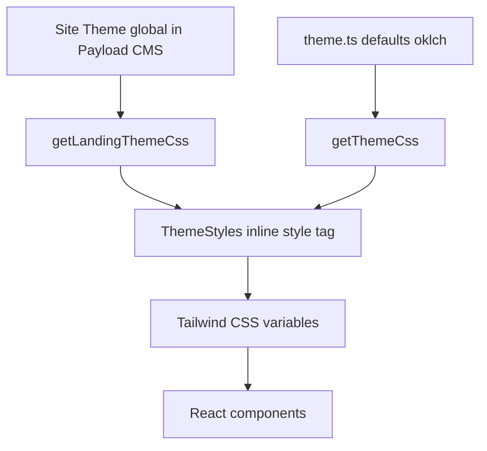

# Design System Documentation — Black Oak Coffee Co.

> **Audience:** UI/UX improvement agent  
> **Live site:** [https://muradsprojects.co.uk/](https://muradsprojects.co.uk/)  
> **Repo:** Payload CMS ecommerce/booking template (Next.js + Tailwind 4)

---

## 1. Executive summary

The deployed site uses the **Default** CMS theme palette (near-monochrome grays) with **Geist Sans** typography. The visual language is intentionally minimal and editorial — uppercase mono navigation, large prose headings, rounded cards — but the live UI suffers from **low surface contrast**, **inconsistent token sources**, and **weak action hierarchy** on the homepage.

The user's initial assessment is accurate: homepage look, contrast, and UX can be improved without changing CMS architecture.

---

## 2. Screenshot index

All paths relative to `docs/ui-audit/`.

### Priority pages (review these first)

| Page | Desktop light | Desktop dark | Mobile light |
|------|---------------|--------------|--------------|
| Homepage | `screenshots/desktop/light/home.png` | `screenshots/desktop/dark/home.png` | `screenshots/mobile/light/home.png` |
| Shop | `screenshots/desktop/light/shop.png` | `screenshots/desktop/dark/shop.png` | `screenshots/mobile/light/shop.png` |
| Book / Workshops | `screenshots/desktop/light/book.png` | `screenshots/desktop/dark/book.png` | `screenshots/mobile/light/book.png` |

### All captured routes

`/`, `/shop`, `/about`, `/blog`, `/contact`, `/book`, `/account`, `/find-order`, `/login`

Each route has 4 captures: desktop/mobile × light/dark.

Raw computed tokens: see `audit-data.json`.

---

## 3. Architecture overview

**Two theme layers merge at runtime:**

1. **`src/config/theme.ts`** — oklch defaults for shadcn tokens (`--primary`, `--muted`, etc.)
2. **`src/config/siteTheme.ts`** — CMS 5-color palette mapped to landing + semantic tokens (`--background`, `--landing-*`, etc.)

`ThemeStyles` injects both. **Site palette overrides** background/foreground/card/border; **oklch defaults remain** for primary, muted, destructive, etc.

---

## 4. Live color tokens (computed from homepage)

### Light mode (live)

| Token | Live value | Seed default | Notes |
|-------|-----------|--------------|-------|
| `--background` | `#FFFFFF` | `#FFFFFF` | Page background |
| `--foreground` | `#111827` | `#111827` | Body text |
| `--card` | `#F6F7F9` | `#F6F7F9` | Card/section surfaces |
| `--border` | `#D3D9E2` | `#E5E7EB` | Slightly custom |
| `--landing-background` | `#FFFFFF` | same as background | Hero outer bg |
| `--landing-card-background` | `#F6F7F9` | same as card | Hero inner card |
| `--landing-card-border` | `#D3D9E2` | accent color3 | Very subtle |
| `--landing-heading` | `#111827` | lightText | |
| `--landing-body` | `#111827` | lightText | Same as heading — no hierarchy |
| `--primary` | `oklch(20.5% 0 0deg)` | ~`#333` | From theme.ts, not palette |
| `--primary-foreground` | `oklch(98.5% 0 0deg)` | white | |
| `--radius` | `0.625rem` (10px) | | |

**Contrast issue:** `#FFFFFF` page vs `#F6F7F9` card = **~1.04:1** — essentially invisible separation.

### Dark mode (live)

| Token | Live value | Issue |
|-------|-----------|-------|
| `--background` | `#111827` | OK |
| `--foreground` | `#F9FAFB` | OK |
| `--card` | `#1F2937` | Low separation from bg (~1.2:1) |
| `--border` | `#D3D9E2` | **Bug:** light border on dark bg |
| `--landing-card-border` | `#D3D9E2` | Same issue in hero |

### Palette library (CMS — not currently using a named brand palette)

Available in `src/utilities/themePalettes.ts`: `default`, `slate`, `zinc`, **`warm-clay`**, **`sandstone`**, `forest`, `sage`, `ocean`, etc.

For a coffee brand, **`warm-clay`** or **`sandstone`** would be better starting points than `default`.

---

## 5. Typography

### Font families

| Role | Stack | Source |
|------|-------|--------|
| Sans (body, headings) | `GeistSans`, fallback ui-sans-serif | `geist` package, `layout.tsx` |
| Mono (nav, prices, labels) | `GeistMono` | Product grid, nav links |

### Live computed sizes (homepage)

| Element | Size | Weight | Line height |
|---------|------|--------|-------------|
| `body` | 16px | 400 | 24px |
| `h1` (hero) | **64px** | 400 | 71px |
| Section h2 | ~24px (`text-2xl`) | 500 | — |
| Nav links | ~12px (`text-xs`) | 500 | uppercase, tracking-widest |
| Product title/price | mono, `text-primary/50` | — | |

### Typography scale in code

| Class | Usage |
|-------|-------|
| `text-2xl font-medium` | Block titles (Features, FAQ) |
| `text-3xl font-medium` | Page titles (shop filters, account, book) |
| `text-lg font-medium` | Service cards, product titles |
| `prose h1` | **4rem (64px)** fixed in `tailwind.config.mjs` typography plugin |

**Critical:** Hero h1 does **not** scale down on mobile — still 64px at 390px viewport (see `screenshots/mobile/light/home.png`).

### Heading reset

`globals.css` unsets default h1–h6 font-size/weight; sizes come from Tailwind classes or `@tailwindcss/typography` prose.

---

## 6. Spacing & layout

### Breakpoints

| Token | Value |
|-------|-------|
| `sm` | 40rem (640px) |
| `md` | 48rem (768px) |
| `lg` | 64rem (1024px) |
| `xl` | 80rem (1280px) |
| `2xl` | 86rem (1376px) |

### Container

- Horizontal padding: `1rem` (sm), `2rem` (md+)
- Max-width follows breakpoint
- Main layout: `body` = `min-h-screen flex flex-col`; `main` = `flex-1`

### Common spacing patterns

| Pattern | Classes | Where |
|---------|---------|-------|
| Section vertical rhythm | `my-16`, `py-16 md:py-24` | Blocks, hero |
| Card padding | `p-6`, `p-8 md:p-14` | Features, landing hero |
| Grid gaps | `gap-8`, `gap-10` | Features 2–3 col, book grid |
| Hero negative margin | `-mt-10 md:-mt-14` | Pulls hero under header border |

---

## 7. Border radius

| Token | Value | Usage |
|-------|-------|-------|
| `--radius` | 0.625rem (10px) | Base |
| `rounded-md` | calc(radius - 2px) | Buttons |
| `rounded-lg` | var(--radius) | Feature cards |
| `rounded-2xl` | 16px | Hero cards, product images |
| `rounded-full` | pills | Grid labels, some CTAs |

---

## 8. Component inventory

### 8.1 Header (`src/components/Header/`)

- **Structure:** Logo (left) → nav links (hidden mobile) → Cart/Login (right)
- **Nav styling:** `appearance="nav"` → ghost variant with `uppercase font-mono tracking-widest text-xs`, color `text-primary/50`
- **Active state:** CSS underline via `.navLink::after` using `var(--primary)`
- **Mobile:** Hamburger → slide-out menu
- **Issue:** Nav opacity 50% reduces contrast; no site name visible (logo icon only)

### 8.2 Footer (`src/components/Footer/`)

- **Colors:** Hardcoded `text-neutral-500`, `border-neutral-200` — **not theme tokens**
- **Contains:** Logo, footer nav, ThemeSelector (Auto/Light/Dark)
- **Copyright:** "Designed in London" tagline

### 8.3 Buttons (`src/components/ui/button.tsx`)

| Variant | Appearance |
|---------|------------|
| `default` | `bg-primary text-primary-foreground` — dark fill |
| `outline` | bordered card bg |
| `ghost` / `nav` | muted text, uppercase mono |
| `secondary` | secondary surface |
| `destructive` | red |

Sizes: `default` h-9, `lg` h-10, `clear` (no padding — used for nav)

### 8.4 CMS Link (`src/components/Link/index.tsx`)

Maps CMS link appearance to Button variants or inline `<Link>`.

### 8.5 Hero — Landing Preset (`src/heros/LandingPreset/`)

Two layouts from CMS:
- **`landingSpotlight`:** Centered card on page bg (nested card effect)
- **`landingSplit`:** 2-column text + image

Uses `--landing-*` CSS vars for colors.

### 8.6 Features block (`src/blocks/Features/`)

Layouts:
- **`default`:** `rounded-lg border bg-card p-6`
- **`minimal`:** `border-l-2 border-primary/40 pl-5` — **used on homepage** (very subtle)

### 8.7 FAQ block (`src/blocks/FAQ/`)

Radix accordion, `text-sm font-medium` triggers, chevron from lucide-react.

### 8.8 Banner block (`src/blocks/Banner/`)

Info/success/warning/error variants with semantic border + tinted bg.

### 8.9 Product grid item (`src/components/ProductGridItem/`)

- Image: `aspect-square rounded-2xl border p-8 bg-primary-foreground`
- Title/price: `font-mono text-primary/50`, hover → full primary
- **Issue:** 50% opacity prices hard to read

### 8.10 Shop page

- Left sidebar: category + sort filters (text links)
- Search bar full width
- 3-column product grid
- See `screenshots/desktop/light/shop.png`

### 8.11 Book page (`src/app/(app)/book/page.tsx`)

- Filter bar: search, duration, pricing, sort dropdowns
- `Apply filters` primary button + Reset link
- Service cards with image, title, description, duration/price pills
- "View details" outline button on hover

### 8.12 Theme selector

Radix Select in footer — Auto / Light / Dark. Stored in `localStorage` key `payload-theme`.

---

## 9. Icons & imagery

- **Logo:** Custom SVG (`src/components/icons/logo.tsx`) — geometric mark, no wordmark in header
- **Icons:** lucide-react (accordion chevron, cart, etc.)
- **Product/hero images:** CMS Media collection, `rounded-2xl` framing
- **Carousel:** embla-carousel (used in some blocks)

---

## 10. Motion & interaction

| Animation | Duration | Where |
|-----------|----------|-------|
| Nav underline | 0.3s transform | Header CSS |
| Product hover scale | 300ms ease | ProductGridItem |
| Accordion | 0.2s | FAQ |
| Cart drawer | 0.2s slide | Cart modal |
| Page fade-in | html opacity 0 → 1 on theme init | globals.css |

Focus rings: `ring-2 ring-neutral-400` (hardcoded neutral, not `--ring`).

---

## 11. Dark mode behavior

- Selector: `[data-theme='dark']` on `<html>`
- Tailwind: `@custom-variant dark (&:is([data-theme='dark'] *))`
- Init: `InitTheme` script reads localStorage/system preference before paint
- **Flash prevention:** `html { opacity: 0 }` until theme attribute set

---

## 12. Key source files for UI changes

| Area | File(s) |
|------|---------|
| Theme token generation | `src/config/siteTheme.ts`, `src/config/theme.ts` |
| CSS injection | `src/components/ThemeStyles/index.tsx` |
| Global styles | `src/app/(app)/globals.css` |
| Tailwind config | `tailwind.config.mjs` |
| Typography scale | `tailwind.config.mjs` → `typography.DEFAULT.css.h1` |
| Header | `src/components/Header/index.client.tsx`, `index.css` |
| Footer | `src/components/Footer/index.tsx` |
| Homepage hero | `src/heros/LandingPreset/index.tsx` |
| Homepage blocks | `src/blocks/Features/`, `FAQ/`, `Banner/` |
| Buttons | `src/components/ui/button.tsx` |
| Product cards | `src/components/ProductGridItem/index.tsx` |
| CMS palettes | `src/utilities/themePalettes.ts`, `src/globals/SiteTheme.ts` |
| Seed content | `src/endpoints/seed/home.ts` |

---

## 13. Recommended improvement areas

Prioritized for the UI agent:

### P0 — Contrast & accessibility

1. **Increase card/surface separation** — darken `--card` or add visible borders/shadows in light mode
2. **Fix dark mode borders** — map `color3` to a dark-appropriate border in `siteTheme.ts` dark mode (not same hex as light)
3. **Remove `/50` opacity** on nav and product metadata — use `--muted-foreground` instead
4. **Responsive hero typography** — e.g. `text-4xl md:text-6xl` instead of fixed 4rem prose
5. **Audit WCAG** — body on `#F6F7F9`, footer `neutral-500`, accordion triggers

### P1 — Homepage UX

1. **Add primary CTA in hero** — "Shop coffee" / "Book a workshop" buttons above the fold
2. **Make category cards clickable** — link to filtered shop routes with hover states
3. **Reduce hero nesting** — consider `landingSplit` or full-bleed hero instead of card-in-card
4. **Differentiate heading vs body** on landing — use `--muted-foreground` for body copy
5. **Balance feature grid** — 5 items in 3-col grid leaves orphan; use 2×3 or carousel

### P2 — Brand & polish

1. **Switch CMS palette** to `warm-clay` or `sandstone` for coffee brand warmth
2. **Replace hardcoded `neutral-*`** in Footer with semantic tokens
3. **Show wordmark** alongside logo in header
4. **Unify focus rings** to use `--ring` token
5. **Product cards** — add subtle shadow, stronger price typography

### P3 — Shop & booking

1. Filter sidebar — add selected states, better touch targets on mobile
2. Book page — card CTAs ("Book now") always visible, not hover-only
3. Empty grid row balance on book page (7 items)

---

## 14. Visual observations from screenshots

### Homepage (light desktop)

- Large whitespace-heavy hero with text-only content in gray card
- H1 "Coffee Worth Slowing Down For" dominates but no action buttons
- Feature categories use left-border minimal style — look like static text, not links
- Hero image (storefront) is strong brand asset but disconnected from hero copy
- Workshop CTA banner is the only clear button on page
- FAQ accordions are functional but visually quiet

### Homepage (dark desktop)

- Improved text contrast on headings
- Card surfaces still barely distinguishable from background
- Light gray borders look out of place on dark surfaces
- Primary buttons (white on dark) work well

### Homepage (mobile light)

- H1 wraps awkwardly at 64px — "Slowing Down" orphaned
- Header cramped: hamburger + tiny logo + CART
- Long scroll before any interactive CTA
- Footer links very small

### Shop

- Clean grid but product titles/prices low contrast (mono 50%)
- Sidebar filters lack visual hierarchy
- Generous whitespace — could use tighter product density

### Book

- Good content structure
- Filter controls light and easy to miss
- Cards missing obvious "Book" action until hover

---

## 15. CMS content context

Seeded as **Black Oak Coffee Co.** hybrid mode (ecommerce + booking). Homepage blocks:

1. Landing hero (spotlight) — headline + intro
2. Content block — secondary headline + paragraph
3. Features (minimal layout) — 5 category cards
4. Media block — storefront photo
5. Banner/CTA — "Learn From Our Roasters" + Book a Session
6. FAQ — 3 questions

Changing copy/structure: Payload admin → Pages → Home, or `src/endpoints/seed/home.ts`.

---

## 16. Dependencies (design-related)

- **Tailwind CSS 4** with `@tailwindcss/typography`
- **shadcn/ui** patterns (Radix + CVA)
- **class-variance-authority** for button variants
- **next-themes** pattern via custom Theme provider
- **Geist** font family
- **lucide-react** icons

---

## 17. Suggested agent workflow

1. Review screenshots in §2 (homepage light/dark/mobile first)
2. Read §13 prioritized improvements
3. Prototype token changes in `siteTheme.ts` + `theme.ts` (consider `warm-clay` palette)
4. Update hero component for responsive type + CTAs
5. Fix Features minimal cards → interactive linked cards with hover
6. Replace Footer hardcoded neutrals
7. Run `pnpm exec tsx scripts/capture-ui-audit.ts` to compare before/after
8. Validate with `tsc --noEmit` after changes

---

*Generated from live site audit + codebase analysis. Token data: `audit-data.json`.*
